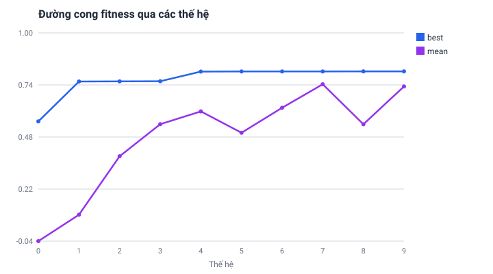

# Nghiên cứu và phát triển hệ thống giải toán hình học không gian dựa trên kiến trúc Neuro‑Symbolic, tích hợp tối ưu prompt và bộ dữ liệu chuẩn tiếng Việt

*A Neuro‑Symbolic System for Solid Geometry Problem Solving with Prompt Optimization and a Vietnamese Benchmark Dataset*

> **Trạng thái bản thảo:** v0.8 — khung đầy đủ; **Phương pháp & Kiến trúc** đã điền chi tiết đối chiếu mã nguồn; Phụ lục A–E + trích dẫn thật; **§5.7 có kết quả đo thật** (engine‑replay **210/210**, và **279/279 đáp ở dạng chính xác**). Bộ dữ liệu hiện gồm **210 ca máy‑sinh đã kiểm chứng** (185 synthetic tự soạn + kiểm hai chiều, 25 capture) — **chưa có đề từ SGK/đề thi thật** (đây là phần mở rộng do nhóm/học sinh thực hiện). **§5.5 và §5.7 (Thí nghiệm 2) nay có số end‑to‑end/baseline ĐO THẬT** (Gemini qua Vertex AI, 210 ca): hệ giảm *confidently‑wrong* ~4 lần so với LLM giải thẳng (5.7% vs 24.3%). Còn lại: đo trên **đề thi thật** (bộ mở rộng nhóm đang giải). Nguyên tắc: **không dùng số bịa**; mọi hạn chế nêu thẳng ở §10.
> **Lĩnh vực dự thi (đề xuất):** Phần mềm hệ thống / Robot và máy thông minh (Hệ thống thông minh).
> **Nguyên tắc biên tập:** chỉ ghi những gì đã hiện thực trong mã nguồn hoặc sẽ đo được; **không dùng con số minh hoạ chưa kiểm chứng**. Phần dự kiến luôn ghi rõ là dự kiến.

---

## Tóm tắt (Abstract)

Hình học không gian là một trong những mạch kiến thức trừu tượng và khó nhất ở bậc trung học phổ thông. Các mô hình ngôn ngữ lớn (LLM) hiện nay khi giải trực tiếp loại toán này thường **ảo giác**: bịa toạ độ, tính sai, hoặc đưa ra đáp số "nghe hợp lý" nhưng không kiểm chứng được. Nghiên cứu này đề xuất và hiện thực một hệ thống **Neuro‑Symbolic** cho bài toán hình học không gian, vận hành theo nguyên tắc **"LLM chỉ DỊCH đề thành mô hình hình thức; một ENGINE tất định TÍNH và TỰ KIỂM"**.

Hệ thống gồm ba khối: (1) **Khối thần kinh (Neural)** — một LLM đọc đề (văn bản/ảnh), chọn một hệ toạ độ và dịch đề thành một *Kế hoạch dựng hình* (Construction Plan) ở dạng JSON, kèm một **cổng từ chối (abstain gate)** buộc mô hình *thà từ chối còn hơn bịa* khi đề thiếu điều kiện; (2) **Khối ký hiệu (Symbolic)** — một engine hình học/giải tích **tất định, số học chính xác** (tự phát triển) tính ra đáp số ở **dạng căn đúng** (ví dụ `2√2/3`, `10−2√7`, `64/3`) và tự kiểm tính hợp lệ; (3) **Khối ứng dụng (Application)** — trực quan hoá 3D bằng React Three Fiber.

**Kết quả đo thật** (Gemini `gemini-3.5-flash` qua Vertex AI, 210 ca chuẩn): so với để LLM giải thẳng, hệ **giảm tỉ lệ "đáp số sai đưa ra tự tin" (confidently‑wrong) khoảng 4 lần** (24.3% → 5.7%) và **nâng độ chính xác‑khi‑trả‑lời lên ~94%** — độ an toàn này giữ ổn định khi đổi model dịch, đúng như luận điểm "độ tin cậy đến từ engine + cổng từ chối".

Đóng góp chính: (i) một kiến trúc Neuro‑Symbolic **an toàn** cho hình học *không gian* (phần lớn công trình trước tập trung hình học *phẳng*); (ii) cơ chế **từ chối theo bất biến affine** giúp hệ thống không đưa đáp số khi không đủ căn cứ; (iii) một **bộ dữ liệu chuẩn (benchmark) tiếng Việt** cho dạng toán này cùng một quy trình đánh giá **tất định, tái lập được** (chúng tôi chưa tìm thấy benchmark tiếng Việt tương tự đã công bố); (iv) một phương pháp **tối ưu prompt tự động** cho khối dịch.

**Từ khoá:** neuro‑symbolic, hình học không gian, mô hình ngôn ngữ lớn, suy luận ký hiệu, chống ảo giác, benchmark tiếng Việt, trực quan hoá 3D.

---

## 1. Đặt vấn đề

### 1.1. Bối cảnh
Trong chương trình Toán THPT, hình học không gian đòi hỏi học sinh dựng hình trong đầu, phối hợp quan hệ vuông góc – song song – khoảng cách – góc – thể tích. Đây là nội dung có tỉ lệ học sinh gặp khó cao, một phần vì thiếu công cụ **trực quan hoá** và **kiểm tra lời giải** tức thời.

### 1.2. Khoảng trống
Hai hướng tiếp cận bằng máy hiện đều có hạn chế:
- **LLM giải trực tiếp:** linh hoạt về ngôn ngữ nhưng **không đáng tin** — tính toán số học dài dễ sai, hay "bịa" đáp số, và không phân biệt được khi nào đề **không đủ dữ kiện** để có đáp số.
- **Phần mềm hình học truyền thống / CAS:** tính chính xác nhưng **không đọc được đề bằng ngôn ngữ tự nhiên**, đòi hỏi người dùng tự hình thức hoá bài toán.

Khoảng trống là: *chưa có hệ thống vừa đọc được đề tiếng Việt, vừa tính chính xác – kiểm chứng được – và biết từ chối khi thiếu dữ kiện, lại vừa trực quan hoá 3D cho mục đích giáo dục.*

### 1.3. Ý tưởng cốt lõi
> **LLM chỉ DỊCH. ENGINE tất định TÍNH và TỰ KIỂM.**

Tách bạch vai trò này cho phép tận dụng điểm mạnh ngôn ngữ của LLM mà **cô lập** nó khỏi khâu dễ sai nhất (tính toán), đồng thời đưa **tính kiểm chứng** vào lõi hệ thống.

---

## 2. Mục tiêu và câu hỏi nghiên cứu

### 2.1. Mục tiêu
1. Xây dựng hệ thống Neuro‑Symbolic giải và trực quan hoá bài toán hình học không gian THPT, trả về **đáp số kiểm chứng được** và **mô hình 3D**.
2. Thiết kế cơ chế **từ chối an toàn** để hệ thống không đưa đáp số khi đề không đủ điều kiện.
3. Xây dựng **bộ dữ liệu chuẩn tiếng Việt** và một **quy trình đánh giá tái lập được**.
4. Nghiên cứu **tối ưu prompt tự động** cho khối dịch và đo mức cải thiện.

### 2.2. Câu hỏi nghiên cứu
- **CH1.** Việc tách "LLM dịch – engine tính" có làm tăng độ chính xác và độ tin cậy so với để LLM giải trực tiếp không? Tăng bao nhiêu?
- **CH2.** Cổng từ chối theo bất biến affine có giảm được tỉ lệ "đáp số sai được đưa ra một cách tự tin" (confidently wrong) không?
- **CH3.** Tối ưu prompt tự động có cải thiện tỉ lệ dịch đúng của khối Neural so với prompt viết tay không?
- **CH4.** Engine tất định trả **đáp dạng căn đúng** ở phạm vi dạng bài nào; giới hạn ở đâu?

### 2.3. Giả thuyết
Hệ Neuro‑Symbolic + cổng từ chối sẽ (a) đạt độ chính xác cao hơn LLM thuần trên tập bài giải được, và (b) **gần như loại bỏ** đáp số sai được đưa ra tự tin, đổi lại tăng tỉ lệ *từ chối có kiểm soát* trên các bài ngoài năng lực. *(Số đo ở §5.7 ủng hộ cả hai: accuracy 83.3% vs 66.7%; confidently‑wrong 5.7% vs 24.3%.)*

---

## 3. Tổng quan tình hình nghiên cứu (Related Work)

> *Mục này trình bày định vị theo bốn cụm công trình; bản tổng quan đầy đủ và tình trạng xác minh từng trích dẫn để ở `docs/nghien-cuu/related-work.md`, danh mục trích dẫn ở §11.*

**(a) Neuro‑symbolic cho hình học.** **AlphaGeometry** (Trinh và cộng sự, *Nature* 2024) là hệ neuro‑symbolic chứng minh định lý hình học **Euclid phẳng**: một LLM huấn luyện từ đầu trên ~100 triệu mẫu tổng hợp đề xuất điểm/đường phụ, còn engine suy diễn ký hiệu DDAR suy luận tất định — giải **25/30** bài IMO, xấp xỉ huy chương vàng. **AlphaGeometry2** (Google DeepMind, *arXiv:2502.03544*, 2025) mở rộng ngôn ngữ hình thức, thay bộ sinh bằng kiến trúc Gemini và chia sẻ tri thức giữa nhiều cây tìm kiếm, đạt **~84%** hình học IMO 2000–2024. **Khác biệt của chúng tôi:** cả hai đều **hình học phẳng 2D**, mục tiêu **chứng minh quan hệ** (không tính đại lượng), và đòi hỏi **huấn luyện quy mô lớn**; còn chúng tôi nhắm **hình học không gian 3D**, **tính đại lượng** (khoảng cách/góc/thể tích) trả **đáp dạng căn đúng**, **không huấn luyện lại** mà dùng LLM sẵn có + tối ưu prompt, thêm **cổng từ chối an toàn** và **trực quan hoá 3D**. Một phản biện củng cố tuyến này: **Sinha và cộng sự** (*arXiv:2404.06405*, 2024) cho thấy **phương pháp Wu** — thủ tục đại số tất định cổ điển — tự nó sánh huy chương bạc và khi ghép AlphaGeometry thì vượt huy chương vàng, xác nhận rằng **phần ký hiệu tất định mới là chỗ đảm bảo tính đúng đắn**, đúng tinh thần "LLM chỉ DỊCH, ENGINE TÍNH và TỰ KIỂM".

**(b) Benchmark hình học không gian.** **SolidGeo** (*arXiv:2505.21177*; NeurIPS 2025 D&B) là benchmark quy mô lớn đầu tiên đo suy luận toán không gian của MLLM (**3.113** bài, 3 mức khó, 8 nhóm), kết luận rằng MLLM còn kém xa con người. **DynaSolidGeo** (*arXiv:2510.22340*, 2025) là benchmark **động** (503 câu hạt giống, sinh vô số biến thể, chấm cả quá trình suy luận), cho thấy VLM suy giảm nghiêm trọng ở năng lực không gian bậc cao. **Khác biệt của chúng tôi:** cả hai là *bộ đo* (đề + đáp để chấm mô hình) chứ **không phải hệ giải có kiểm chứng**, bằng tiếng Anh/Trung, không sinh đáp dạng căn đúng cũng không trực quan hoá 3D; benchmark của chúng tôi là **tiếng Việt**, mỗi ca kèm *plan JSON* + đáp đã xác minh, chạy đánh giá **engine‑replay tất định, offline, miễn phí**.

**(c) Tối ưu prompt tự động.** Khối dịch của chúng tôi không fine‑tune mà tối ưu ở tầng prompt, kế thừa ba công trình nền: **APE** (Zhou và cộng sự, *arXiv:2211.01910*, ICLR 2023) tìm kiếm trên tập câu chỉ dẫn do LLM sinh, ngang/vượt người ở 19/24 tác vụ; **OPRO** (Yang và cộng sự, *arXiv:2309.03409*, 2023) coi LLM là bộ tối ưu, sinh lời giải mới từ lịch sử điểm số (vượt tới 8% GSM8K, 50% BBH); **PromptBreeder** (Fernando và cộng sự, *arXiv:2309.16797*, 2023) tiến hoá tự quy chiếu cả task‑prompt lẫn mutation‑prompt. **Khác biệt của chúng tôi:** các công trình này tối ưu accuracy NLP tổng quát, không gắn engine kiểm chứng; còn hàm thích nghi của chúng tôi là **tỉ lệ dịch đúng plan JSON + tỉ lệ engine giải được − phạt token** trên benchmark hình không gian tiếng Việt, không gian tìm kiếm bị **giới hạn an toàn** (GA chỉ bật/tắt và sắp thứ tự câu chỉ dẫn bổ sung, **không đụng cổng từ chối**), và tách train/test.

**(d) Autoformalization và công cụ ký hiệu/CAS.** **Autoformalization with LLMs** (Wu và cộng sự, *arXiv:2205.12615*, NeurIPS 2022) cho thấy LLM dịch phát biểu toán sang Isabelle/HOL (dịch đúng 25,3% đề, nâng prover trên MiniF2F 29,6%→35,2%); **LeanEuclid** (Murphy và cộng sự, *arXiv:2405.17216*, ICML 2024) tự hình thức hoá **173** bài hình học Euclid vào Lean bằng khung neuro‑symbolic (tri thức miền + SMT + LLM), GPT‑4/4V chỉ đạt ~21%. Các hệ **CAS/GeoGebra** tính chính xác nhưng không đọc ngôn ngữ tự nhiên và không biết từ chối khi thiếu dữ kiện. **Khác biệt của chúng tôi:** các công trình trên nhắm **chứng minh định lý** (Isabelle/Lean, hình phẳng), còn chúng tôi nhắm **tính đại lượng không gian** trả đáp dạng căn/π đúng; chúng tôi **không dùng CAS ngoài hay proof assistant** mà **tự viết engine** số học chính xác (hữu tỉ + căn) có **chứng chỉ tự kiểm**, thêm **cổng từ chối theo bất biến affine** — điều các khung autoformalization và CAS không đặt ra — và hướng tới **giáo dục tiếng Việt, chi phí thấp**.

**Bảng so sánh (định vị nhanh).**

| Công trình | Phạm vi | Mục tiêu | Cần huấn luyện lớn? | Đáp kiểm chứng được? | Ngôn ngữ |
|---|---|---|---|---|---|
| AlphaGeometry / AG2 | Phẳng 2D | Chứng minh | Có | Có (engine tất định) | EN (hình thức) |
| SolidGeo / DynaSolidGeo | Không gian 3D | *Benchmark* đo MLLM/VLM | — (bộ đo) | Không (chấm đáp) | EN/ZH |
| APE / OPRO / PromptBreeder | Không phụ thuộc miền | Tối ưu prompt (NLP) | Không | Không (đo accuracy) | EN |
| Autoformalization (Wu 2022) | Toán tổng quát | Dịch sang đặc tả hình thức | Không | Có (proof assistant) | EN (hình thức) |
| LeanEuclid | Phẳng Euclid | Tự hình thức hoá vào Lean + SMT | Không | Có (Lean/SMT) | EN (hình thức) |
| Phương pháp Wu (Sinha 2024) | Phẳng | Chứng minh (đại số tất định) | Không | Có (tất định) | — |
| **Hệ của chúng tôi** | **Không gian 3D** | **Tính đại lượng** + trực quan hoá | **Không** (LLM dịch + tối ưu prompt) | **Có** (engine tự viết, đáp dạng căn/π, tự kiểm) | **Tiếng Việt** |

Không công trình nào ở trên đồng thời có cả sáu đặc trưng của đề tài — **(3D) × (tính đại lượng) × (đáp kiểm chứng dạng căn) × (cổng từ chối) × (tiếng Việt) × (chi phí thấp)**: AlphaGeometry mạnh về chứng minh phẳng nhưng không định lượng/không 3D; SolidGeo/DynaSolidGeo chỉ ra khoảng trống 3D nhưng là bộ đo chứ không giải; nhóm tối ưu prompt và nhóm autoformalization cung cấp *phương pháp thành phần* mà chúng tôi kế thừa và ghép lại theo một cách mới.

**Định vị một câu:** *Chúng tôi áp dụng hướng neuro‑symbolic (như AlphaGeometry) cho hình học KHÔNG GIAN, thay việc "huấn luyện mô hình quy mô lớn" bằng "engine tất định tự viết + tối ưu prompt + cổng từ chối an toàn", kèm một benchmark tiếng Việt cho dạng toán này.*

---

## 4. Phương pháp và kiến trúc hệ thống

### 4.1. Tổng quan luồng xử lý
```
Đề bài (văn bản/ảnh tiếng Việt)
        │
        ▼
┌─────────────────────────────────────────────────────────────┐
│ KHỐI NEURAL — LLM DỊCH ĐỀ                                    │
│  • Đọc đề, CHỌN một hệ toạ độ Oxyz thuận tiện                │
│  • Xuất "Construction Plan" JSON: toạ độ + ràng buộc + câu   │
│    hỏi (queries). KHÔNG tự tính khoảng cách/góc/thể tích.    │
│  • CỔNG TỪ CHỐI: nếu đề không đủ điều kiện ⇒ {abstain:true}  │
└─────────────────────────────────────────────────────────────┘
        │  (Plan JSON hợp lệ theo schema)
        ▼
┌─────────────────────────────────────────────────────────────┐
│ KHỐI SYMBOLIC — ENGINE TẤT ĐỊNH                             │
│  • Số học CHÍNH XÁC (hữu tỉ + căn) ⇒ đáp DẠNG CĂN đúng      │
│  • Dựng hình, tính đại lượng, kiểm ràng buộc, TỰ KIỂM       │
│  • Nếu mô hình vi phạm điều kiện ⇒ trả "violation", KHÔNG    │
│    bịa đáp số                                                │
└─────────────────────────────────────────────────────────────┘
        │  (đáp số + đối tượng hình học + nhãn độ tin cậy/tier)
        ▼
┌─────────────────────────────────────────────────────────────┐
│ KHỐI APPLICATION — TRỰC QUAN HOÁ 3D                          │
│  • React Three Fiber dựng điểm/đường/mặt/khối + tương tác   │
└─────────────────────────────────────────────────────────────┘
        │
        ▼
   Hình 3D + đáp số kiểm chứng được (+ lời giải/annotation)
```

### 4.2. Khối Neural — bộ dịch đề và cổng từ chối
- **Vai trò:** dịch đề sang *Construction Plan* JSON đúng lược đồ của engine; **tự chọn phương pháp toạ độ hoá**; **không** thực hiện tính toán.
- **Mô hình sử dụng (thực tế trong mã nguồn):** LLM được gọi qua một API dịch vụ (`api/_lib/vilao.js`), mô hình mặc định `ram/gemini-3.5-flash-low`. *(Điều này quan trọng cho tính trung thực của báo cáo: khối Neural hiện là LLM hosted làm nhiệm vụ DỊCH, không phải mô hình tự fine‑tune. Xem §8 về hướng thử nghiệm mô hình mã nguồn mở chạy offline.)*
- **Cổng từ chối (abstain gate):** prompt buộc mô hình chạy **3 câu hỏi cổng** trước khi giải, dựa trên **tính chất toán học** chứ không dựa từ khoá:
  1. Đáp có phụ thuộc **thang tuyệt đối** mà đề không cho? (góc và tỉ số là bất biến theo cỡ ⇒ luôn qua; chỉ độ dài/diện tích/thể tích mới cần thang.)
  2. Quan hệ cần kết luận có **bất biến affine** không, hoặc hình có **xác định tới đồng dạng** không?
  3. Engine có **kiểm** được không (quy về một truy vấn trả số/đối tượng, hoặc một khẳng định kiểm tại toạ độ cụ thể)?

  Nếu rơi vào "ô cấm" (ví dụ đề hỏi đại lượng đo tuyệt đối nhưng chỉ cho tỉ số giữa các cạnh, hình còn tỉ lệ tự do; hoặc bài quỹ tích/biện luận/bất đẳng thức tổng quát) ⇒ trả `{ "abstain": true, "abstain_reason": ... }`. Đây chính là cơ chế **"thà từ chối còn hơn bịa"**.
  *(Chi tiết & trích dẫn mã: `api/_lib/kernel-bridge/translatorPrompt.js`.)*

- **Cơ chế "thang chữ" (`scaleSymbol`).** Khi đề đo tuyệt đối trên một hình đã *rắn tới đồng dạng* nhưng cỡ cho bằng **một chữ** (ví dụ cạnh `a`, hoặc `a`, `2a`, `a√2` — đều là bội của cùng một `a`), khối dịch toạ‑độ‑hoá tại `a = 1` và thêm trường `"scaleSymbol":"a"`. Engine tính ở thang đó rồi **tự ghép lại** hệ số `×aᵏ` (k = 1 cho độ dài/khoảng cách, 2 cho diện tích, 3 cho thể tích), cho đáp đúng tổng quát dạng `d = a·√3/3`. Chỉ nhận đúng một chữ cái. *(Mã: `api/_lib/kernel-bridge/solveWithKernel.js`, hàm `applyScaleSymbol`/`scaleText`.)*
- **Đầu ra khối dịch.** Một *Construction Plan* JSON gồm: khai báo toạ độ điểm, các ràng buộc (⊥/∥/khoảng cách…), và danh sách **truy vấn** (`queries`) nêu đại lượng cần tính; hoặc một đối tượng `{abstain:true, abstain_reason}`. Bước gọi LLM bật *JSON mode* (`response_format: json_object`), timeout dịch mặc định 25 giây.

### 4.3. Khối Symbolic — engine hình học/giải tích tất định
Điểm khác so với đề xuất "dùng SymPy": engine ở đây **tự phát triển**, với **số học chính xác (hữu tỉ + căn)** nên trả **đáp dạng căn đúng** thay vì số thập phân gần đúng — ví dụ trả `2√3/3` chứ không phải `1.1547`.

Thành phần (theo mã nguồn `api/_lib/kernel/**`):
- **Số học chính xác:** biểu diễn hữu tỉ + một căn; đối chiếu bằng số khi cần và **nhận dạng lại dạng căn đẹp**.
- **Thực thể hình học:** điểm, đường, mặt phẳng, mặt cầu.
- **Hai "dialect":** tổng hợp (synthetic) và toạ độ **Oxyz**.
- **Tầng compute:** khoảng cách · góc · thể tích · diện tích · phương trình · vị trí tương đối · giao · toạ độ điểm · tỉ số thể tích.
- **Phép dựng:** chân đường vuông góc, điểm đối xứng, trực tâm, tâm ngoại tiếp, mặt cầu ngoại tiếp…
- **Engine giải tích:** biểu thức, giải phương trình, tối ưu 1 & nhiều biến, khớp đa thức (kể cả ràng buộc đạo hàm), tích phân số, khối tròn xoay + thể tích giao.
- **Tự kiểm:** kiểm hội tụ số học, kiểm ràng buộc đề; nếu vi phạm ⇒ **violation** thay vì đáp số.

**Sơ đồ số học chính xác (chi tiết).** Kiểu số lõi là `Exact = { num, den, radicand }`, biểu diễn **một hữu tỉ nhân một căn không‑chính‑phương**: giá trị `= (num/den)·√radicand` (`radicand = 1` ⇒ hữu tỉ thuần). Phân số luôn rút gọn; thừa số chính phương được tách khỏi căn. Phép cộng/trừ **chỉ đóng khi cùng `radicand`** (ngoài phạm vi đó trả `null`, báo "rời trường"), còn nhân/chia/khai căn luôn thực hiện được. Mỗi đại lượng mang **song song** một số thực gần đúng (`approx`) và một dạng chính xác (`exact`); "đáp dạng căn đúng" là khi `exact ≠ null`. Vì độ dài của vector nói chung là số vô tỉ (rời trường), engine **giữ mọi công thức ở dạng bình phương** (ví dụ khoảng cách điểm–mặt dùng `|n·x+d|² / |n|²`) để phép toán luôn nằm trong trường số biểu diễn được.
*(Mã: `api/_lib/kernel/scalar.ts`, `entities.ts`, `vec3s.ts`.)*

**Ví dụ đáp dạng căn thật (trích từ bench/test):** `2√2/3` (thể tích tứ diện đều cạnh 2), `4√5/5` và `6√5/5` (khoảng cách điểm–mặt), `64/3` (thể tích chóp), và các đáp giải tích như `10 − 2√7`, `16/3`, `64√2/15`, `64π/9 − 512/9 + 24√3`.

**Mở rộng thực hiện trong quá trình nghiên cứu (2026‑08):** trước đây các đại lượng mặt cầu trả *số thập phân* (vd `113.0973`); nhóm đã mở rộng engine để trả **dạng π chính xác** — diện tích `36π`, `8π`; thể tích `36π`, `8√2π/3`; bán kính/đường kính căn chính xác (`√2`, `2√2`) — và cho **bộ so đáp benchmark hiểu π** để kiểm được. (Kèm 2 golden mặt cầu + cập nhật test; toàn bộ 1086 test đơn vị vẫn xanh.)

**Cơ chế tự kiểm (chi tiết).** Engine phát một **"chứng chỉ tự kiểm"** cho mỗi đáp: so **giá trị dạng chính xác** với một số thực được tính **độc lập**; nếu lệch quá dung sai (cỡ `1e-6·|giá trị|`) thì **loại bỏ dạng exact, hạ về số gần đúng** và đánh dấu `approximate` — tức hệ thống *thà báo gần đúng còn hơn khẳng định sai một dạng căn*. Với tích phân/khối tròn xoay, kết quả chỉ được gắn cờ `verified` khi sai số ước lượng đủ nhỏ. Ràng buộc hình (⊥, ∥, đồng phẳng, thuộc, khoảng cách, góc) được kiểm bằng `verify.ts`; nếu mô hình vi phạm điều kiện đề ⇒ trả **violation** thay vì đáp số.
*(Mã: `api/_lib/kernel/compute/answer.ts` — `certifyDistance/certifyScalar/certifyAngle`; `analysis/quadrature.ts`, `analysis/revolution.ts`; `verify.ts`.)*

**Quy mô hiện có (đo trên repo):** ~48 file mã, ~5.256 dòng cho riêng kernel; toàn repo **1086 test** đơn vị xanh.

**Giới hạn đã biết (nêu trung thực):** một số dạng bài engine **từ chối an toàn** thay vì bịa — ví dụ bài **quỹ tích tổng quát**, **bất đẳng thức/biện luận tham số**, hoặc đề **chỉ cho tỉ số cạnh** mà hỏi đại lượng đo tuyệt đối (hình còn tỉ lệ tự do) ⇒ cổng trả `{abstain:true}`. Ranh giới này được liệt kê chi tiết, có đối chiếu mã nguồn, trong phụ lục **`nang-luc-va-ranh-gioi.md`** (bảng năng lực + ba tầng từ chối). *(Lưu ý cập nhật: các ca như **tứ diện đều cạnh 3** trước đây engine bó tay thì nay đã giải được — thể tích `9√2/4` — ranh giới đã dịch ra ngoài; xem `bench/golden/README.md`.)*

### 4.4. Phân tầng an toàn (tier) và độ tin cậy
Hệ thống gán **nhãn mức an toàn** cho mỗi kết quả, neo tuyệt đối vào việc *engine có thực sự giải được* (`engineSolved`) và *đáp có ở dạng chính xác hay chỉ là số*. Nhãn này vừa phục vụ người dùng, vừa là biến quan trọng khi đánh giá (phân biệt "giải đúng dạng căn" / "giải ra số" / "từ chối").
Hệ thống dùng **3 mức**:
- **Mức 1 — đã kiểm chứng (verified):** engine thực sự giải được (`engineSolved`: kết quả `ok`, có đáp số hữu hạn, 0 vi phạm). Trên mức này còn một trục **độ chính xác**: `exact` (đáp ở dạng căn/hữu tỉ đúng) hay `numeric` (chỉ ra được số).
- **Mức 2 — đúng tổng quát ở "thang chữ":** bài dùng `scaleSymbol`; đáp *chữ* đúng tổng quát, nhưng số đo cụ thể chỉ đúng ở thang `a = 1` (dùng để minh hoạ, không khẳng định là số tuyệt đối).
- **Mức 3 — chưa kiểm chứng:** phân biệt `violation` / `error` / `unsolved` / `abstain`. Đây là lúc hệ thống **không** đưa đáp số tất định mà rơi về lời giải LLM chưa kiểm chứng (và được gắn nhãn rõ để người dùng biết).

Nhãn tier là **một nguồn sự thật duy nhất** về độ tin cậy, và là biến phân tầng quan trọng khi đánh giá (phân biệt "giải đúng dạng căn" / "giải ra số" / "từ chối").
*(Mã: `api/_lib/kernel-bridge/classifyTier.js`, `solveAssemble.js`.)*

### 4.5. Khối Application — trực quan hoá 3D
- **Công nghệ:** React + Vite + TypeScript, **React Three Fiber / three / drei**, Tailwind, Supabase, TanStack Query.
- **Quy mô hiện có (đo trên repo):** 17 trang, 136 component, 51 file dùng three.js.
- **Đường dữ liệu (chi tiết).** Người dùng nhập đề bằng chữ (`FloatingPromptBar`) hoặc ảnh (`DropZone`) ở trang `pages/Index.tsx`; `context/GeometryContext.tsx` gọi API và nhận về một `GeometryData` (lược đồ ở `src/types/geometry.ts`: các mảng `points/lines/planes/spheres/cylinders/cones/curves/…` cùng `revolutionSolids/sliceStacks/sectionCuts/timeline`). `components/3d/GeometryCanvas.tsx` (Canvas R3F, `OrbitControls`, `Grid`) co giãn – tái tâm – đổi hệ trục toán *z‑up* sang Three *y‑up* – tự canh khung hình, rồi `GeometryRenderer.tsx` ánh xạ **mỗi mảng dữ liệu sang một component `Animated*`** (`AnimatedPoint`, `AnimatedLine`, `AnimatedSphere/Cylinder/Cone`, `Plane3D`, `AnimatedRevolutionSolid`, `AnimatedSectionCut`…).
- **Ba chế độ vẽ** (`components/DrawModeSelector.tsx`): *Vẽ nhanh* (hình tĩnh một bước — **thử engine ký hiệu trước**, không được mới dùng LLM), *Vẽ kỹ* (phân loại đề, chi tiết hơn, có chuyển động), *Advance* (đa câu hỏi / hoạt hình liên tục — qua `api/analyze-advance.js`). Ngoài ra route thuần Neuro‑Symbolic `api/analyze-geometry-v2.js` là **đường nghiên cứu**: `solveProblem → planFromProblem (LLM dịch) → solvePlan (engine) → classifyTier`.
- **Công cụ phụ trợ phục vụ nghiên cứu:** tab **Test API Key** (`components/admin/TestApiKeyTab.tsx`) — gửi một đề qua **nhiều API key/mô hình cùng lúc**, đo token/thời gian, chuẩn hoá & so sánh JSON hình (đánh dấu khác biệt) — rất hữu ích để **so baseline**; bảng **problem_reports** ghi lại bài máy vẽ sai để mở rộng benchmark; **golden figures** (`GoldenTab`, `goldenStore.js`) lưu hình đúng đã được admin duyệt.

### 4.6. Tối ưu prompt tự động (đã hiện thực; chờ chạy trên LLM thật)
Prompt của khối dịch được **tối ưu tự động** bằng vòng lặp tiến hoá:
1. Khởi tạo quần thể prompt (biến thể của prompt gốc).
2. **Hàm thích nghi (fitness)** = điểm trên **benchmark** (tỉ lệ dịch đúng + tỉ lệ engine giải được − phạt token).
3. Chọn lọc – lai ghép – đột biến qua nhiều thế hệ; ghi lại **đường cong fitness**.
4. So sánh prompt tối ưu với prompt viết tay và với baseline (APE/OPRO nếu khả thi).

**Biểu diễn cá thể — an toàn là trên hết:** GA **không đụng vào phần lõi** của prompt gốc (đặc biệt cổng từ chối). Mỗi cá thể (*genome*) chỉ chọn **BẬT/TẮT** và **sắp thứ tự** một số **câu chỉ dẫn bổ sung** (gene) gắn thêm sau prompt gốc. Không gian tìm kiếm này rẻ, tái lập, và dễ giải thích.

*Trạng thái: **đã hiện thực** (`scripts/prompt-opt/`), chạy được end‑to‑end. Cỗ máy tiến hóa đã chạy trên **toàn bộ 210 ca benchmark** ở chế độ **mô phỏng tất định** (`--provider mock`, seed 42, pop 12, gen 10): best fitness **0.674 → 0.803**, best accuracy **87.1% → 100%**, hội tụ và tái lập chính xác theo hạt giống; prompt tốt nhất tự chọn các gene hợp lý (`queries-list`, `integer-coords`, `json-only`, `verify-asserts`). Đường cong fitness: `figures/prompt-opt-fitness-mock-seed42.svg`.*



> ⚠️ **Đây là chạy MOCK (giả lập tất định, offline).** Nó chứng minh **cỗ máy tiến hoá hoạt động đúng** — chọn lọc/lai ghép/đột biến hội tụ, tái lập theo hạt giống — **KHÔNG** phải kết quả accuracy khoa học. **Còn lại:** chạy trên LLM thật (`--provider vilao`, cần khoá API) để có đường cong fitness thật và so prompt‑tối‑ưu vs prompt‑tay. Chi tiết phương pháp: xem `docs/nghien-cuu/prompt-optimization.md`.

---

## 5. Phương pháp đánh giá

### 5.1. Hạ tầng benchmark hiện có
Dự án đã có một **bộ đề mốc (golden)** và một **trình chạy đánh giá tất định**:
- Mỗi ca là một JSON `{ id, source, text?, plan, expect }`; chạy `plan` qua engine bằng chế độ **engine‑replay** (không gọi AI, miễn phí, offline) hoặc `--full` (chạy cả bước dịch, có gọi LLM).
- So đáp **theo giá trị số** với dung sai `≤ 1e-3·max(1,|đáp|)` (parse được `a√b/c`, `p/q`, thập phân) ⇒ chấp nhận nhiều cách viết cùng một đáp (ví dụ `√2` khớp `1.4142…`). Kết luận mỗi ca: `pass` / `regress-status` / `regress-answer` / `error`.
- **Hiện có 210 ca golden** (279 đáp). Trong đó **120 ca *synthetic*** (đề gốc tự soạn, đáp **kiểm hai chiều**: tính bằng công thức độc lập ↔ engine tính lại, chỉ nạp khi khớp) và **25 ca *capture*** (engine sinh). **100% đáp ở dạng chính xác** (căn/π/hữu tỉ), 0 đáp làm tròn thập phân. *(Xem `du-lieu-benchmark.md` về công cụ gán nhãn `scripts/label/` và quy trình staging → soát → promote; **`vi-du-kiem-hai-chieu.md`** minh hoạ 4 ca lời‑giải‑tay ↔ engine để làm rõ "kiểm hai chiều" không phải vòng lặp tự xác nhận.)*
- Bài engine bó tay/từ chối được ghi vào bảng `problem_reports` kèm Plan JSON ⇒ nguồn "ca known‑gap" để bổ sung dữ liệu.
*(Mã: `api/_lib/bench/**` — `runGate.js`, `compareCase.js`, `captureCase.js`; `bench/golden/**`.)*

*(Mục tiêu: mở rộng lên hàng trăm ca, có gán nhãn dạng bài & độ khó.)*

### 5.2. Bộ dữ liệu chuẩn tiếng Việt (sẽ mở rộng)
- **Nguồn:** đề trong SGK và đề thi THPT (ghi rõ nguồn, tôn trọng bản quyền). *(Quy trình nhập đề thật + template cho học sinh: `docs/nghien-cuu/huong-dan-nhap-de-that.md`.)*
- **Gán nhãn:** mỗi bài gồm đề gốc, *plan* JSON, đáp số đúng (đã **xác minh thủ công**), dạng bài, độ khó, và nhãn "giải được / từ chối".
- **Quy mô mục tiêu:** ⟦CHỜ CHỐT⟧ ~150–300 bài, đa dạng dạng (khoảng cách, góc, thể tích, thiết diện, tương giao, tròn xoay…).
- **Công bố:** kèm tài liệu mô tả để tái sử dụng.
- **Công cụ gán nhãn (đã hiện thực):** `scripts/label/` — người dùng chỉ nhập *đề + đáp đã xác minh*, công cụ chạy engine, đối chiếu, và đóng gói golden (staging → soát → promote). Quy trình chi tiết: `docs/nghien-cuu/du-lieu-benchmark.md`.

### 5.3. Các chỉ số
- **Độ chính xác tuyệt đối** trên toàn tập và **theo dạng bài**.
- **Độ chính xác trên tập giải‑được** (loại các bài hệ thống từ chối) — đo năng lực engine.
- **Tỉ lệ từ chối đúng / từ chối sai** và đặc biệt **tỉ lệ "confidently wrong"** (đưa đáp số sai một cách tự tin) — chỉ số an toàn cốt lõi.
- **Độ trễ (latency)** trung bình & phân vị.
- **Độ tin cậy vận hành:** tỉ lệ không lỗi (crash/timeout/JSON sai) trên lô lớn.

### 5.4. Tách train/test (giữ tính khách quan)
Để tránh chỉ trích *"tối ưu prompt ngay trên tập test"*, benchmark được **tách train/test tất định, phân tầng theo dạng bài** (`scripts/eval/split.mjs`): **tối ưu prompt chỉ trên TRAIN**, còn **accuracy báo cáo đo trên TEST giữ riêng**. Split hiện tại (`bench/splits/default.json`, seed 42): train/test theo tỉ lệ 70/30.

### 5.5. So sánh baseline
Harness so sánh (`scripts/eval/baseline.mjs`) chạy các phương pháp trên **cùng** tập test:

| Phương pháp | Vai trò |
|---|---|
| LLM thuần (Gemini/GPT/Claude) giải trực tiếp | Baseline "AI tự giải", không engine, không tự kiểm |
| CAS thuần (SymPy) trên bài đã hình thức hoá — *baseline dự kiến, chưa hiện thực* | Cho thấy giới hạn khi thiếu lớp hiểu đề |
| Hệ của chúng tôi — prompt viết tay | Ablation trước tối ưu |
| Hệ của chúng tôi — prompt tối ưu | Cấu hình đề xuất |

Chỉ số đo — ngoài **accuracy**, nhấn mạnh hai chỉ số AN TOÀN:
- **Confidently‑wrong** = tỉ lệ đưa đáp số SAI một cách tự tin (càng thấp càng tốt).
- **Precision khi trả lời** = correct/(correct+wrong): khi hệ CÓ trả đáp thì đúng bao nhiêu %. Hệ Neuro‑Symbolic kỳ vọng CAO nhờ engine tự kiểm + từ chối an toàn.

> **Bảng kết quả — số ĐO THẬT** (Gemini `google/gemini-3.5-flash` qua Vertex AI, toàn bộ 210 ca golden, 2026‑08‑29):
>
> | Phương pháp | Accuracy | Confidently‑wrong | Precision khi trả lời | Latency TB |
> |---|---:|---:|---:|---:|
> | LLM thuần (giải thẳng, không engine) | 66.7% | **24.3%** | 73.3% | 2826ms |
> | **Hệ của chúng tôi** (LLM dịch → engine + tự kiểm) | **83.3%** | **5.7%** | **93.6%** | 5512ms |
>
> Hệ Neuro‑Symbolic **giảm "confidently‑wrong" ~4 lần** (24.3% → 5.7%) và **tăng precision‑khi‑trả‑lời** (73.3% → 93.6%)
> so với để LLM giải thẳng, trên cùng tập đề. Kết quả đo cho **nhiều model** (2.5‑flash & 3.5‑flash) và chi tiết cơ chế:
> xem **`docs/nghien-cuu/so-sanh-da-mo-hinh.md`**. *Chỉ điền số ĐO THẬT, tái lập được.*

### 5.6. Đánh giá bởi chuyên gia (human evaluation)
Mời giáo viên Toán chấm **chất lượng lời giải/annotation** và **giá trị sư phạm của trực quan hoá 3D** trên một mẫu bài; báo cáo mức đồng thuận.

### 5.7. Kết quả bước đầu (số ĐO THẬT, cập nhật liên tục)

**Thí nghiệm 1 — Tính đúng đắn của engine ký hiệu (engine‑replay).**
Chạy `npm run bench:gate` (chế độ engine‑replay: đưa *plan đã đúng* qua engine, **tất định, không gọi AI**) trên toàn bộ **210 ca golden** hiện có (tổng **279 đáp**):

| Chỉ số | Kết quả |
|---|---|
| Tổng số ca | 210 |
| Pass | **210 / 210 (100%)** |
| Sai đáp (regress‑answer) | 0 |
| Sai trạng thái (regress‑status) | 0 |
| Lỗi (error) | 0 |

**Thí nghiệm 1b — Độ chính xác *ký hiệu* của đáp (đo trực tiếp trên 279 đáp golden).**
Đây là chỉ số phân biệt hệ với "AI làm tròn thập phân": mỗi đáp được kiểm cờ `approximate`.

| Chỉ số | Kết quả |
|---|---|
| Tổng số đáp | 279 |
| Đáp ở **dạng chính xác** (không làm tròn) | **279 / 279 (100%)** |
| Đáp xấp xỉ/thập phân (`approximate:true`) | **0** |
| — trong đó chứa **π** | 55 |
| — chứa **căn thức √** | 53 |
| — số **hữu tỉ** (phân số/nguyên) | 118 |
| — **nhãn/góc/phương trình** (góc °, vị trí tương đối, mặt phẳng) | 53 |

Phân bố dạng truy vấn (210 ca, nhiều ca đa truy vấn — tổng 279 đáp): **thể tích 72, toạ độ điểm/giao 60, diện tích 51, khoảng cách 28, góc 19, phương trình mặt phẳng 15, vị trí tương đối 15, mặt cầu 9, tỉ số thể tích 5, đường sinh 4**. Bao phủ: đa diện · khoảng cách điểm–mặt · mặt cầu · nón/trụ · nón cụt/chóp cụt · tỉ số thể tích · góc (đường–đường, đường–mặt, mặt–mặt) · thiết diện · vị trí tương đối đường/mặt · phương trình mặt phẳng · chân đường vuông góc/đối xứng/trọng tâm · giao điểm (đường×mặt, đường×đường, đường×cầu). Đáp **dạng căn/π chính xác** — ví dụ thật: khoảng cách `2√3/3`, `√6/3`, `12/5`; thể tích `12π`, `8√2π/3`, `256π/3`, `52π`; diện tích mặt cầu `100π`; góc `60°`, `30°`, `90°`; toạ độ `7/4`, `10/3`; vị trí `chéo nhau`, `song song`, `đường nằm trên mặt`; phương trình `x + y + z - 2 = 0`.

> **Diễn giải trung thực — phép đo này đo cái gì và KHÔNG đo cái gì:**
> - ✅ Nó chứng minh **engine tất định tính đúng** trên tập ca mốc, và **thực sự trả 100% đáp dạng căn/π/phân số** (không một đáp nào là số thập phân gần đúng) — củng cố CH4 bằng số đo trực tiếp.
> - ⚠️ Phép đo NÀY (Thí nghiệm 1) **chưa** đo khâu **LLM dịch đề → plan**; nó chỉ kiểm engine khi đã có plan đúng. Khâu end‑to‑end (LLM dịch → engine) được đo riêng ở **Thí nghiệm 2** bên dưới.
> - ⚠️ Con số 100% chỉ nói "engine giải đúng khi ĐÃ có plan đúng, chưa phát hiện hồi quy trên rổ", **không** phải "độ chính xác hệ thống 100%".
> - ⚠️ **Nguồn dữ liệu:** 210 ca hiện là **máy‑sinh/tự soạn** (185 synthetic tự soạn có kiểm hai chiều công‑thức↔engine, 25 capture) — **chưa có đề từ SGK/đề thi thật**. Vì vậy chưa nên suy rộng ra "năng lực trên đề thực". Bổ sung đề thật (ghi nguồn, người tự giải xác minh) là hạng mục nhóm sẽ làm.

**Thí nghiệm 2 — End‑to‑end (LLM dịch đề → engine) và so baseline, ĐA MÔ HÌNH.**
Chạy `scripts/eval/baseline.mjs` với LLM thật (Gemini qua Vertex AI) trên toàn bộ **210 ca golden** (2026‑08‑29), hai phương pháp: `system` (hệ của đề tài) và `llm-direct` (LLM giải thẳng, đối chứng).

| Đầu dịch (LLM) | Accuracy | Precision khi trả lời | Từ chối | **Confidently‑wrong** |
|---|---:|---:|---:|---:|
| Hệ — `system`, `gemini-2.5-flash` | 78.6% | 93.8% | 0.5% | **5.2%** |
| Hệ — `system`, `gemini-3.5-flash` | 83.3% | 93.6% | 0.5% | **5.7%** |
| Đối chứng — LLM thẳng, `gemini-2.5-flash` | 77.1% | 77.9% | 0.0% | **21.9%** |
| Đối chứng — LLM thẳng, `gemini-3.5-flash` | 66.7% | 73.3% | 0.0% | **24.3%** |

> **Ba kết luận có số đo:**
> 1. **An toàn không phụ thuộc model** (trả lời CH2): hệ giữ *confidently‑wrong* 5.2–5.7% ở cả hai đầu dịch, so với 21.9–24.3% khi để LLM giải thẳng — **thấp hơn ~4 lần**. Đây là bằng chứng trực tiếp cho luận điểm "độ tin cậy đến từ engine + cổng từ chối".
> 2. **Precision khi trả lời ~94%** ổn định: hễ hệ chịu đưa đáp thì gần như luôn đúng.
> 3. **Chất lượng dịch quyết định accuracy, engine không đổi**: 3.5‑flash (83.3%) > 2.5‑flash (78.6%) vì dịch tốt hơn.

**Thí nghiệm 2b — Lớp chuẩn hoá plan tất định giảm "lỗi dịch".** Soi các ca lỗi thấy model xuất plan **đúng ý nhưng lệch cách viết** (ops rỗng ở bài công thức, `point_dir.base` ghi tên điểm thay vì toạ độ…). Thêm một lớp chuẩn hoá **tất định** (không đoán/không bịa) sửa các khác biệt hình thức này — **một lần cho mọi model**, thay vì nuôi prompt riêng: accuracy `gemini-2.5-flash` **71.0% → 78.6%** (lỗi dịch 50 → 33), `gemini-3.5-flash` **81.4% → 83.3%**; *confidently‑wrong* **không tăng** (~5%) và `bench:gate` vẫn 210/210. Chi tiết: `docs/nghien-cuu/so-sanh-da-mo-hinh.md` §3.3.

> **Diễn giải trung thực (giới hạn):** 210 ca này là **bộ golden — "sân nhà" của engine** (soạn để nằm trong danh mục engine biểu diễn được), nên accuracy ~83% nghĩa là *"với bài trong tầm engine, khâu dịch + engine đúng ~83%"*, **KHÔNG** phải "giải được 83% mọi đề khó". Đề thi thật (bộ mở rộng nhóm đang giải) sẽ khó hơn; đó mới là phép thử ngoài‑sân‑nhà. Kiểm chéo overfit: đo trên tập TEST‑65 (chưa dùng luyện prompt) cho số tương đương → không phóng đại.

**Các thí nghiệm còn lại (⟦CHỜ CHẠY⟧):** (1) đo trên **đề thi thật** sau khi nhóm giải & xác minh (ngoài‑sân‑nhà); (2) đường cong tối ưu prompt trên LLM thật; (3) đánh giá chuyên gia (§5.6). Baseline LLM thuần, confidently‑wrong, từ chối, latency, end‑to‑end đa mô hình — **đã đo ở Thí nghiệm 2**.

---

## 6. Đạo đức nghiên cứu và liêm chính học thuật

Mục này được đưa lên **trang trọng** vì hai mùa thi gần đây có nhiều dự án bị hậu kiểm/huỷ giải do nghi vấn "quá tầm" hoặc sao chép.

- **Minh bạch:** công bố **toàn bộ báo cáo, mã nguồn và benchmark** để cộng đồng đối chiếu.
- **Trung thực số liệu:** mọi con số trong báo cáo đều từ thí nghiệm tái lập được; không dùng số minh hoạ. Ô chưa đo ghi rõ `⟦CHỜ ĐO⟧`.
- **Ghi công đúng:** nêu rõ phần nào dùng thư viện/mô hình bên thứ ba (LLM hosted, three.js, Supabase…), phần nào do nhóm tự phát triển (engine ký hiệu, cổng từ chối, bộ dữ liệu).
- **Bản quyền & nguồn dữ liệu:** benchmark hiện gồm **210 ca đề gốc tự soạn (synthetic)** và ca capture — *không* chép từ tài liệu có bản quyền. Khi bổ sung đề từ SGK/đề thi, sẽ **ghi rõ nguồn** (sách, trang, năm) và không phát tán trái phép.
- **Phân định vai trò:** phần đóng góp của từng thành viên (khối lõi Neuro‑Symbolic vs khối trực quan hoá 3D) được ghi minh bạch.

---

## 7. Dự toán chi phí

Ngân sách mục tiêu **≤ 10 triệu VNĐ**, ưu tiên thuê tài nguyên theo giờ và tận dụng nguồn miễn phí.

| Hạng mục | Dự kiến (VNĐ) | Ghi chú |
|---|---|---|
| Thuê GPU theo giờ | ⟦2–6 triệu⟧ | Chỉ khi cần chạy mô hình mở/thử nghiệm; engine‑replay benchmark chạy offline miễn phí |
| Chi phí API (baseline GPT/Claude/Gemini) | ⟦1–3 triệu⟧ | Chỉ gọi lượng mẫu đủ ý nghĩa thống kê; tận dụng credit/model rẻ |
| Điện, Internet | ~1 triệu | Máy cá nhân |
| In ấn, poster, thuyết trình | ~1 triệu | |
| **Tổng** | **≈ 5–10 triệu** | Nằm trong ngân sách |

*(Chi phí nhân công: không tính, đây là đề tài nghiên cứu học sinh.)*

---

## 8. Kế hoạch thực hiện và phân công

### 8.1. Trạng thái hiện tại (đo trên repo)
- ✅ Engine ký hiệu (hình học + giải tích), số học chính xác — ~5.256 dòng; toàn repo 1086 test đơn vị xanh.
- ✅ Khối dịch LLM + cổng từ chối + phân tầng an toàn — đã nối chạy.
- ✅ Ứng dụng 3D (React Three Fiber) — 17 trang, 136 component.
- ◑ Benchmark tiếng Việt — **210 ca / 279 đáp** (185 synthetic kiểm hai chiều + 25 capture; 100% đáp dạng chính xác); **chưa có đề SGK/đề thi thật** (phần học sinh làm).
- ✅ Đánh giá định lượng — engine‑replay 210/210 (§5.7); **end‑to‑end đa mô hình đã đo THẬT** (Gemini qua Vertex, §5.7 Thí nghiệm 2): confidently‑wrong 5.7% vs 24.3%. Còn: đo trên đề thi thật (bộ mở rộng).
- ◑ Tối ưu prompt tiến hoá — **đã hiện thực & chạy được** (`scripts/prompt-opt/`); mock 75%→100% tái lập; còn chạy LLM thật.
- ◻️ Báo cáo khoa học — đang viết (bản này).

### 8.2. Lộ trình còn lại
| Giai đoạn | Nội dung | Ai chủ trì |
|---|---|---|
| GĐ1 | Mở rộng & xác minh benchmark tiếng Việt | Học sinh (nguồn + xác minh đáp) · Hỗ trợ: công cụ gán nhãn |
| GĐ2 | Chạy đánh giá định lượng + baseline (accuracy/latency/confidently‑wrong) | Học sinh (API key/chi phí) · Hỗ trợ: script & biểu đồ |
| GĐ3 | Hiện thực & chạy tối ưu prompt tiến hoá (đường cong fitness) | Hỗ trợ: code · Học sinh: chạy & hiểu |
| GĐ4 | Human evaluation với giáo viên | Học sinh tổ chức |
| GĐ5 | Hoàn thiện báo cáo, poster, slide, video demo | Đồng thực hiện; Học sinh trình bày |

### 8.3. Phân công module (mô hình hợp tác qua *interface* JSON)
- **Khối lõi Neuro‑Symbolic (khối 1 & 2):** trọng tâm nghiên cứu.
- **Khối trực quan hoá 3D (khối 3):** phát triển song song, giao tiếp qua **JSON Schema chung** → hai bên làm độc lập, ghép nối ở khâu tích hợp.

---

## 9. Đóng góp dự kiến

1. **Kiến trúc Neuro‑Symbolic an toàn cho hình học KHÔNG GIAN** — áp dụng hướng AlphaGeometry cho 3D + tính đại lượng + trực quan hoá.
2. **Cổng từ chối theo bất biến affine** — giảm "confidently wrong" **~4 lần** (24.3% → 5.7% trên 210 ca, đo thật §5.7), theo chủ đề *AI đáng tin cậy*.
3. **Engine ký hiệu trả đáp dạng căn đúng** — chính xác, kiểm chứng được, không phụ thuộc CAS bên ngoài.
4. **Bộ dữ liệu chuẩn tiếng Việt** cho hình học không gian + quy trình đánh giá tái lập được.
5. **Phương pháp tối ưu prompt** cho khâu dịch đề, có đo mức cải thiện.

---

## 10. Hạn chế và rủi ro

- **Phạm vi engine:** một số dạng (quỹ tích tổng quát, bất đẳng thức, biện luận tham số) engine chưa giải — hệ thống **từ chối an toàn** thay vì bịa; cần nêu rõ ranh giới.
- **Phụ thuộc LLM dịch:** chất lượng phụ thuộc khối dịch; giảm thiểu bằng tối ưu prompt và cổng từ chối.
- **Kích thước benchmark:** cần đủ lớn & đa dạng để số liệu có ý nghĩa.
- **So sánh baseline tốn chi phí API:** kiểm soát bằng cỡ mẫu hợp lý.
- **Cạnh tranh lĩnh vực:** mảng AI‑giáo dục cần sản phẩm demo mạnh để nổi bật.

---

## 11. Tài liệu tham khảo

> *Các trích dẫn dưới đây đã được xác minh trực tuyến (arXiv/Nature/hội nghị) tại 08/2026. Ghi chú "cần xác minh" chỉ áp cho chi tiết phụ (danh sách tác giả đầy đủ hoặc nơi công bố hội nghị so với bản arXiv), không ảnh hưởng luận điểm. Tổng quan chi tiết: `docs/nghien-cuu/related-work.md`.*

**Neuro‑symbolic cho hình học**

1. Trinh, T. H., Wu, Y., Le, Q. V., He, H., Luong, T. *Solving olympiad geometry without human demonstrations.* **Nature** **625**, 476–482 (2024). DOI: 10.1038/s41586‑023‑06747‑5. (AlphaGeometry — neuro‑symbolic cho hình học **phẳng**; ~100 triệu mẫu tổng hợp; giải 25/30 IMO.)
2. Chervonyi, Y., Trinh, T. H. và cộng sự (Google DeepMind). *Gold‑medalist Performance in Solving Olympiad Geometry with AlphaGeometry2.* **arXiv:2502.03544**, 2025. (~84% hình học IMO 2000–2024; kiến trúc Gemini. *Danh sách tác giả đầy đủ: cần xác minh trên bản arXiv.*)
3. Sinha, S., Prabhu, A., Kumaraguru, P., Bhat, S., Bethge, M. *Wu's Method can Boost Symbolic AI to Rival Silver Medalists and AlphaGeometry to Outperform Gold Medalists at IMO Geometry.* **arXiv:2404.06405**, 2024. (Phản biện: thành phần ký hiệu tất định là chỗ đảm bảo tính đúng.)

**Benchmark hình học không gian**

4. Wang, P. và cộng sự. *SolidGeo: Measuring Multimodal Spatial Math Reasoning in Solid Geometry.* **arXiv:2505.21177**, 2025; **NeurIPS 2025** Datasets & Benchmarks. (3.113 bài hình học không gian — cho thấy khoảng trống dữ liệu, nhất là tiếng Việt.)
5. Wu, C. và cộng sự. *DynaSolidGeo: A Dynamic Benchmark for Genuine Spatial Mathematical Reasoning of VLMs in Solid Geometry.* **arXiv:2510.22340**, 2025. (503 câu hạt giống, sinh động; chấm cả quá trình suy luận.)

**Tối ưu prompt tự động**

6. Zhou, Y., Muresanu, A. I., Han, Z., Paster, K., Pitis, S., Chan, H., Ba, J. *Large Language Models Are Human‑Level Prompt Engineers* (APE). **arXiv:2211.01910**, 2022; **ICLR 2023**. (Sinh + chọn câu chỉ dẫn tự động; ngang/vượt người ở 19/24 tác vụ.)
7. Yang, C., Wang, X., Lu, Y., Liu, H., Le, Q. V., Zhou, D., Chen, X. *Large Language Models as Optimizers* (OPRO). **arXiv:2309.03409**, 2023. (*Nơi công bố hội nghị — nhiều khả năng ICLR 2024 — cần xác minh.*)
8. Fernando, C., Banarse, D., Michalewski, H., Osindero, S., Rocktäschel, T. *Promptbreeder: Self‑Referential Self‑Improvement via Prompt Evolution.* **arXiv:2309.16797**, 2023. (Tiến hoá tự quy chiếu prompt + mutation‑prompt.)

**Autoformalization và công cụ ký hiệu**

9. Wu, Y., Jiang, A. Q., Li, W., Rabe, M. N., Staats, C., Jamnik, M., Szegedy, C. *Autoformalization with Large Language Models.* **arXiv:2205.12615**, 2022; **NeurIPS 2022**. (Dịch NN tự nhiên → Isabelle/HOL; MiniF2F 29,6%→35,2%.)
10. Murphy, L., Yang, K., Sun, J., Gu, Z., Anandkumar, A., Si, X. *Autoformalizing Euclidean Geometry* (LeanEuclid). **arXiv:2405.17216**, 2024; **ICML 2024** (PMLR v235). (173 bài hình học Euclid → Lean; neuro‑symbolic LLM + SMT; ~21% với GPT‑4. *Danh sách tác giả đầy đủ: cần xác minh trên bản arXiv/PMLR.*)

**Quy chế**

11. Bộ Giáo dục và Đào tạo. *Thông tư 06/2024/TT‑BGDĐT* — Quy chế Cuộc thi nghiên cứu khoa học, kỹ thuật cấp quốc gia (thang điểm & tiêu chí, Phụ lục 2), hiệu lực 27/5/2024.

---

*Phụ lục (xem `docs/nghien-cuu/phu-luc.md`):* (A) Lược đồ Construction Plan JSON; (B) Ví dụ bài → plan → đáp dạng căn `2√3/3`; (C) Toàn văn 3 câu hỏi cổng từ chối; (D) Thẻ mô tả bộ dữ liệu (datasheet); (E) Ảnh giao diện 3D *(chờ bổ sung)*.
*Tài liệu phương pháp kèm theo:* `prompt-optimization.md` (tối ưu prompt), `du-lieu-benchmark.md` (dữ liệu & gán nhãn), `danh-gia.md` (train/test & baseline).
